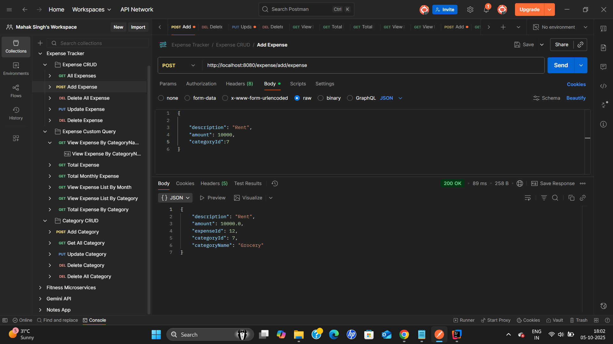

# Expense Tracker Documentation

## 1. Project Overview
Expense Tracker is a Spring Boot-based application that allows users to manage and track their expenses efficiently.  
It provides features for expense and category management and generates detailed reports like monthly and category-wise spending.  
The application uses **PostgreSQL** as the database and exposes REST APIs for interaction.

---

## 2. Assumptions
- Each expense belongs to exactly one category.  
- Expense amount must be positive.  
- Category names are unique.  
- The application is single-user (no authentication implemented yet).  
- Dates are stored in `yyyy-MM-dd` format.  
- Deleting a category does **not** automatically delete associated expenses (manual cleanup needed).

---

## 3. System Design / Architecture

    ```Architecture Diagram


        Client (Postman / Frontend)
         │
         ▼
      ┌───────────────┐
      │ Controller    │
      └───────────────┘
        │
        ▼
      ┌───────────────┐
      │ Service       │
      └───────────────┘
        │
        ▼
      ┌───────────────┐
      │ Repository    │
      └───────────────┘
        │
        ▼
      ┌───────────────┐
      │ PostgreSQL DB │
      └───────────────┘

## 4. Database Schema

### Category Table

| Column Name    | Data Type       | Constraints                     | Description                         |
|----------------|----------------|---------------------------------|-------------------------------------|
| category_id    | BIGSERIAL       | PRIMARY KEY                     | Unique identifier for category      |
| category_name  | VARCHAR(255)    | NOT NULL, UNIQUE                | Name of the category                |
| date           | DATE            | DEFAULT CURRENT_DATE            | Date of category creation           |

---

### Expense Table

| Column Name    | Data Type       | Constraints                                   | Description                                 |
|----------------|----------------|-----------------------------------------------|---------------------------------------------|
| expense_id     | BIGSERIAL       | PRIMARY KEY                                   | Unique identifier for expense               |
| amount         | NUMERIC(10,2)   | NOT NULL, CHECK(amount > 0)                   | Expense amount (must be greater than 0)    |
| description    | VARCHAR(255)    | NULLABLE                                      | Optional description of the expense        |
| date           | DATE            | NOT NULL, DEFAULT CURRENT_DATE                | Expense date                                |
| category_id    | BIGINT          | NOT NULL, FOREIGN KEY → category(category_id) | Links expense to its category               |

---

### Relationships
- **One-to-Many:** Each `Category` can have multiple `Expense` entries.  
- **Cascade Delete / Orphan Removal:** Deleting a category will also delete all associated expenses if configured in JPA (`cascade = ALL, orphanRemoval = true`).  

---

### ER Diagram (Text Representation)

    ```er

     +----------------+       1    +----------------+
     |   Category     |────────────|     Expense    |
     +----------------+            +----------------+
     | category_id PK |            | expense_id PK  |
     | category_name  |            | amount         |
     | date           |            | description    |
     +----------------+            | date           |
                                   | category_id FK |
                                   +----------------+


**Legend:**  
- **PK** = Primary Key  
- **FK** = Foreign Key  
- **1-to-Many** relationship: One Category → Many Expenses  

### 5. Sample Inputs & Outputs with Screenshots

#### 5.1 Add Category

**Request:**

  

#### 5.2 Add Expense

> **Note:** You must **add a category first**.  
> If you try to add an expense without an existing category, the API will return an error like:  
> `"No such category found"`

**Request:**



