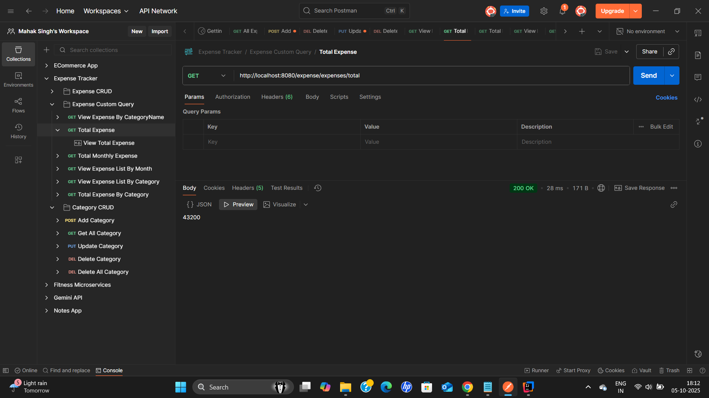
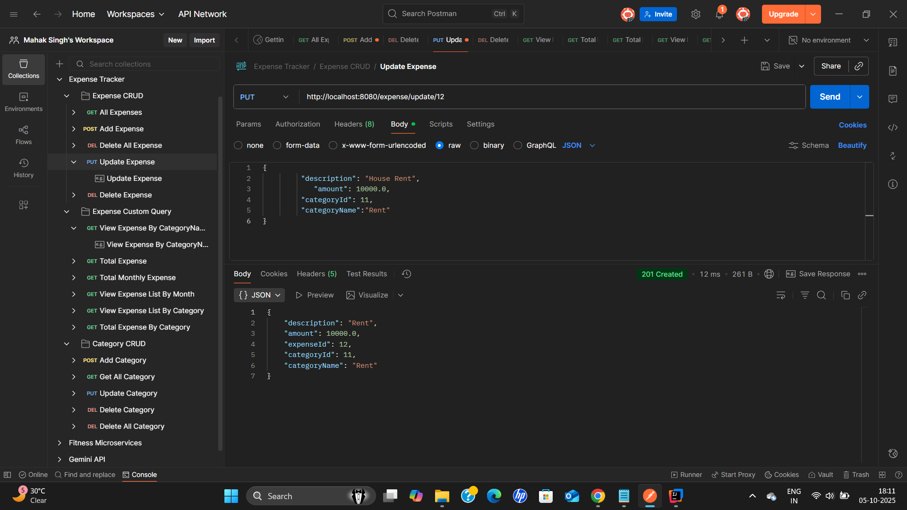
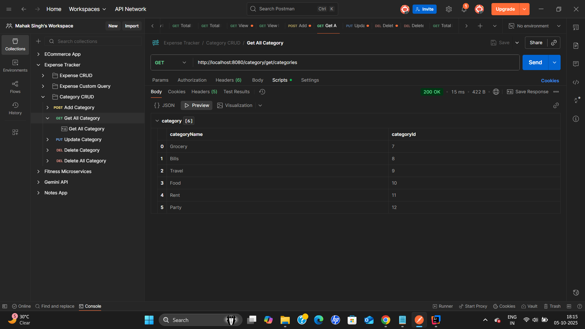
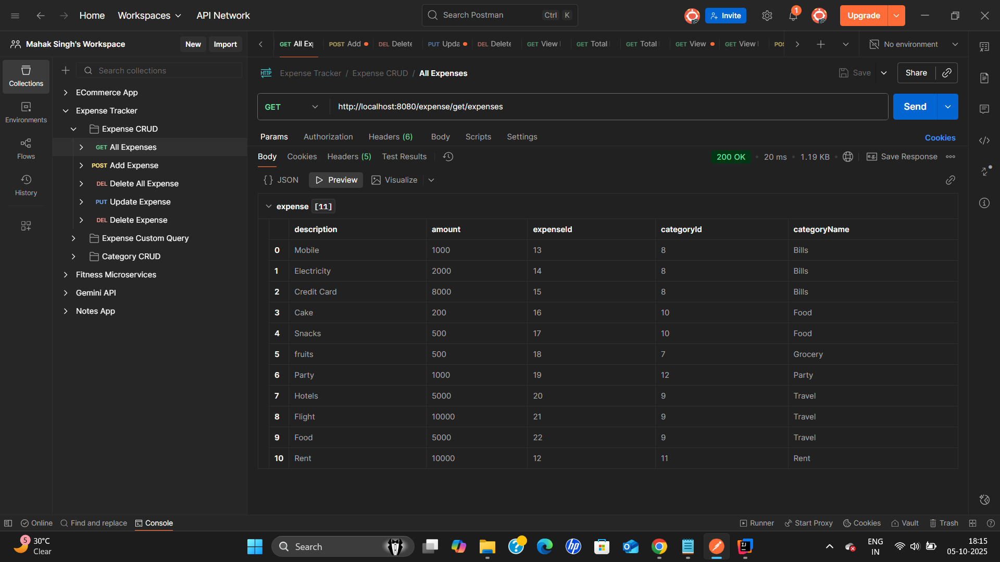
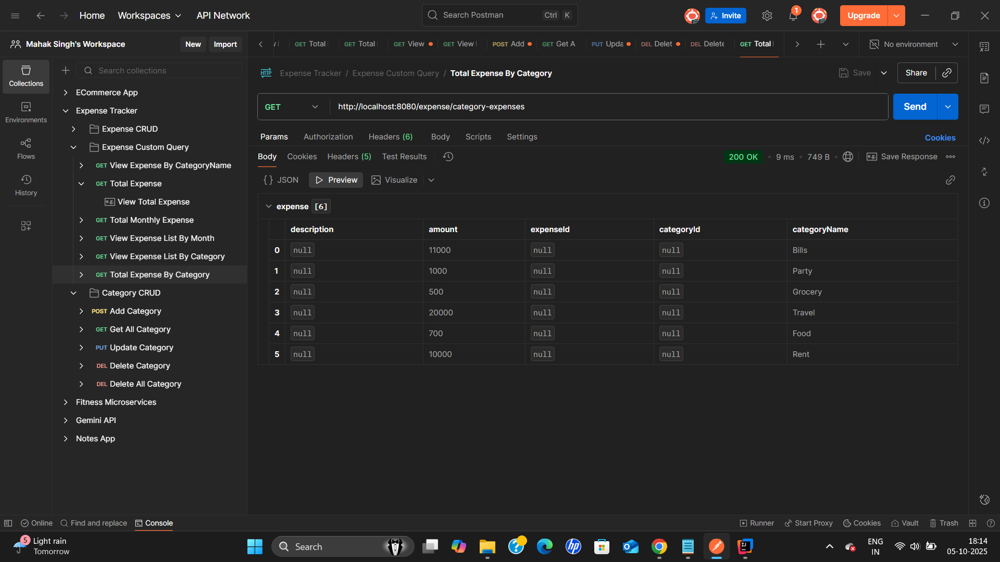
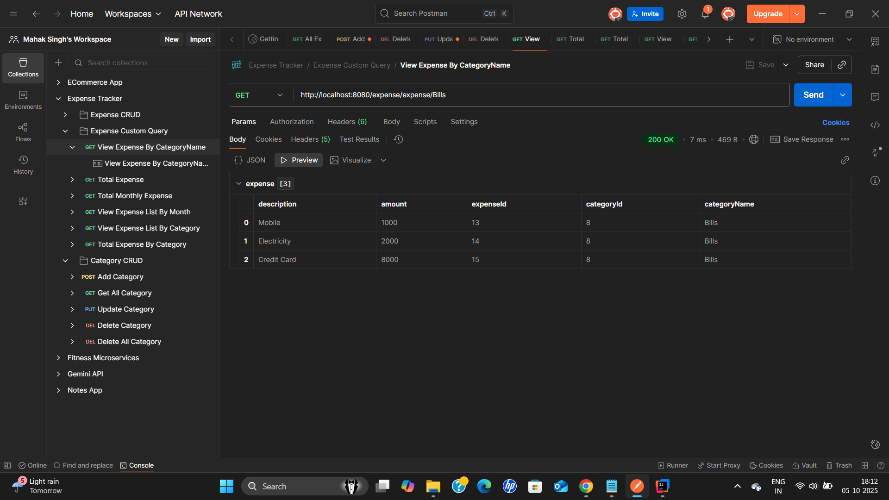
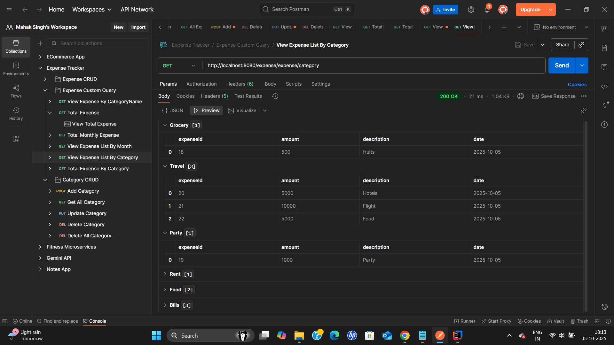
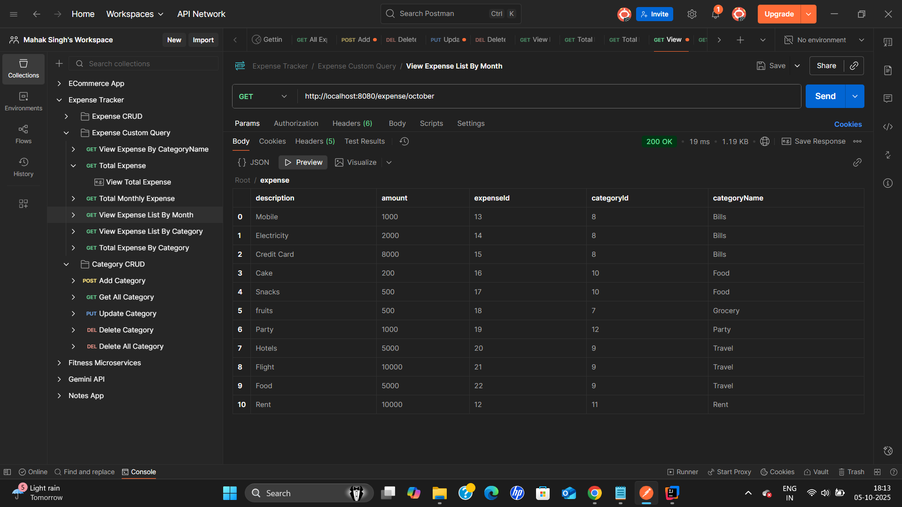

# Expense Tracker

A Spring Boot-based Expense Tracker application that allows users to manage and track their expenses efficiently. The application uses PostgreSQL for the database and includes features like expense management, category management, and detailed reports such as monthly and category-wise spending.

---

## Features

- **Expense Management**
  - Add, update, delete, and view individual expenses
  - Delete all expenses at once
- **Category Management**
  - Add, update, delete, and view categories
  - Delete all categories at once
- **Reports**
  - View expenses month-wise
  - View expenses category-wise
  - View total expenses
  - View total expenses month-wise
  - View total expenses category-wise
  - View all expenses for each category

---

## File Structure

  Expense Tracker Project Structure
  
    ```src
       └── main
            ├── java
            │   └── com.expensetracker.application
            │       ├── controller                    
            │       │   ├── ExpenseController.java
            │       │   └── CategoryController.java
            │       ├── service
            │       │   ├── ExpenseService.java
            │       │   ├── ExpenseServiceImpl.java
            │       │   ├── CategoryService.java
            │       │   └── CategoryServiceImpl.java
            │       ├── repository
            │       │   ├── ExpenseRepository.java
            │       │   └── CategoryRepository.java
            │       ├── model
            │       │   ├── Expense.java
            │       │   └── Category.java
            │       ├── payload
            │       │   ├── ExpenseDTO.java
            │       │   ├── ExpenseResponse.java
            │       │   ├── CategoryDTO.java
            │       │   └── CategoryResponse.java
            │       └── exceptions
            │           ├── APIException.java
            │           ├── ResourceNotFoundException.java
            │           └── GlobalExceptionHandler.java
            └── resources
                       └── application.properties


---
## 📸 Project Screenshots

### Add Category


### Add Expense


### Total Expense


### Update Expense


### View All Category


### View All Expense


### View Total Expense for each category 


### View Total Expense for each month


### View Expense By Category


### View Expense List for each category


### View Expense List for each month



## API Endpoints

### Expense APIs

| Endpoint | Method | Description |
|----------|--------|-------------|
| `/expense/add/expense` | POST | Add a new expense |
| `/expense/get/expenses` | GET | Get all expenses |
| `/expense/update/{expenseId}` | PUT | Update an expense |
| `/expense/delete/expenseid/{expenseId}` | DELETE | Delete a specific expense |
| `/expense/delete/allexpenses` | DELETE | Delete all expenses |
| `/expense/expense/category` | GET | View all expenses category-wise |
| `/expense/expense/{categoryName}` | GET | View expenses by category |
| `/expense/expenses/total` | GET | View total expenses |
| `/expense/monthwise` | GET | View monthly spent |
| `/expense/{month}` | GET | View spent in a specific month |
| `/expense/category-expenses` | GET | View total spent in each category |

### Category APIs

| Endpoint | Method | Description |
|----------|--------|-------------|
| `/category/get/categories` | GET | View all categories |
| `/category/add/category` | POST | Add a category |
| `/category/update/category/{categoryId}` | PUT | Update a category |
| `/category/delete/all` | DELETE | Delete all categories |
| `/category/delete/id/{categoryId}` | DELETE | Delete a specific category |

---

## How to Run

1. **Clone the repository**  

   ```bash
   git clone https://github.com/Mahak-10/Expense-Tracker.git
   cd Expense-Tracker
   
2. **Configure PostgreSQL Database**

1. **Create a database** in PostgreSQL (e.g., `expense_tracker`).  
2. **Update `application.properties`** with your database URL, username, and password:
   
   ```properties
   spring.datasource.url=jdbc:postgresql://localhost:5432/expense_tracker
   spring.datasource.username=your_username
   spring.datasource.password=your_password
   spring.jpa.hibernate.ddl-auto=update

3. **Build and Run the Application**


## Test APIs 

- Import the included **Postman collection** to test all API endpoints.  
- **Sample requests and responses** are already saved in the collection for easy testing.

## Technologies Used

- **Java 17**  
- **Spring Boot**  
- **PostgreSQL**  
- **ModelMapper**  
- **Maven**  
- **Postman** (for API testing)

## Notes

- All DTOs are used for clean data transfer between layers.  
- Global exception handling is implemented for API validation and resource-not-found scenarios.  
- The project is modularized, with separate packages for:
  - **Controllers**  
  - **Services**  
  - **Service Implementations**  
  - **Repositories**  
  - **Models**  
  - **DTOs**  
  - **Exceptions**

