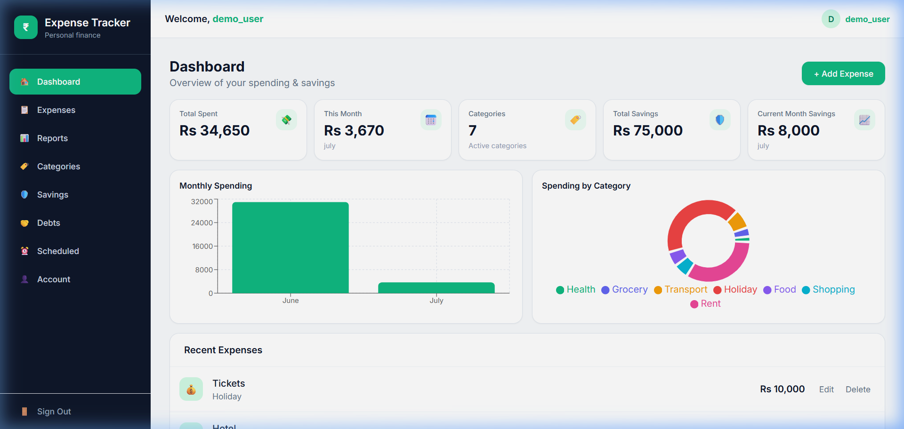
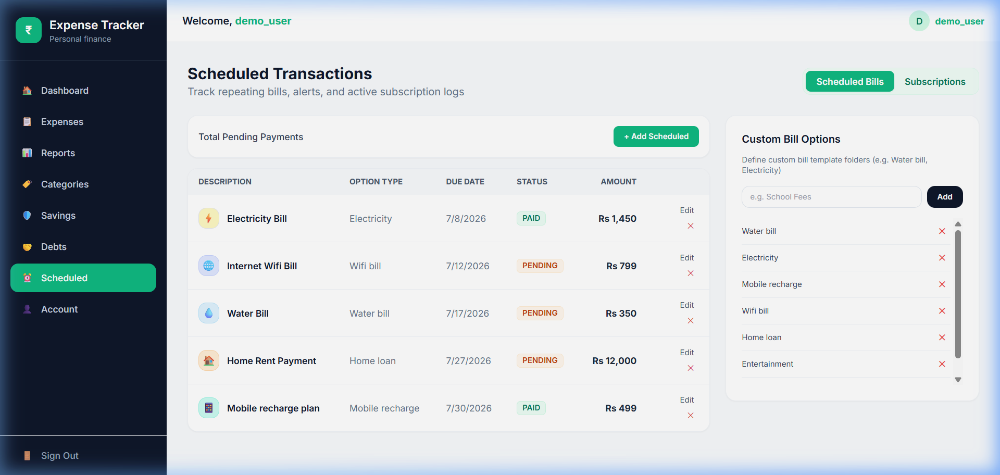
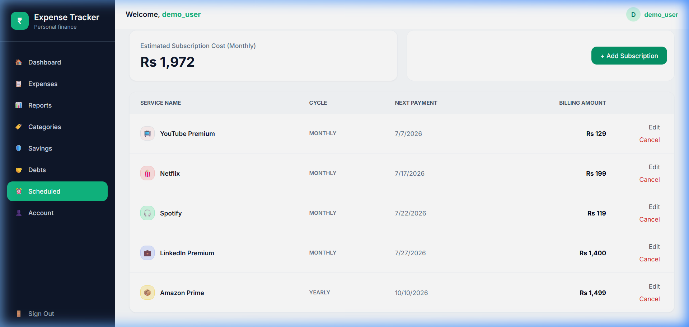

# Expense Tracker

A premium Personal Finance and Expense Tracker application configured to help users track and organize their portfolios efficiently. The stack comprises a robust, multi-user **Spring Boot REST API** backend paired with a modern, fully-responsive **React + Vite** frontend interface. 

---

## Key Features

- **Multi-User Security & Auth**
  - Instant user registration, sign-in, and sign-out capabilities.
  - Secure profile modifications (username changes and password resets).
  - Robust backend resource filtering: all options, categories, expenses, savings, and debts are isolated to each user.
- **Premium Interactive Dashboard**
  - Unified summary cards tracking **Total Spent**, **This Month's Spending**, **Active Categories**, **Total Savings**, and **Current Month's Savings**.
  - Dynamic monthly trend bar charts and category allocation donut charts rendered via Recharts.
  - Direct display of recent expenses for fast tracking.
- **Core Tracking Layers**
  - **Expenses**: CRUD individual entries with name, value, date, and custom category mappings.
  - **Savings**: Dedicated savings logs detailing descriptions, dates, and amounts (no income tab required).
  - **Debts**: Manage money given or borrowed using the dedicated Debt tracker separated by status (*Owed to Me* vs *Owed to Others*).
- **Advanced Bills & Subscriptions Planning**
  - **Scheduled Bills**: Stay on top of utilities (Water, Electricity, Wireless Wifi, Mobile, etc.) with custom options and payment toggles.
  - **Subscriptions Tracker**: Track recurring streaming and utility packages (Netflix, Spotify, YouTube Premium, LinkedIn, Amazon Prime) showing billing cycle, cost, payment due date, and automatically displaying brand icons.
- **Explore Demo Mode (Recruiter View)**
  - Direct portal bypassing standard registration to view a pre-seeded account (`demo_user`) with **Rs 34,650** of preloaded financial logs.
  - **Self-Healing Mechanics**: Every time a user enters Demo Mode, the database cleans all previous mutations, additions, or deletions and restores the demo profile back to the pristine default setup.
- **Rupee (Rs) Support**
  - The UI is fully localized to display amounts in Rupees (Rs).

---

## User Interface Screenshots

### Modern Compact Dashboard


### Scheduled Bills Utility


### Brand Subscriptions Tracker


---

## File Structure

```text
Expense-Tracker/
├── application/                     # Spring Boot Backend
│   ├── src/main/java/com/expensetracker/application/
│   │   ├── controller/              # REST Endpoints
│   │   │   ├── AuthController.java
│   │   │   ├── CategoryController.java
│   │   │   ├── DebtController.java
│   │   │   ├── ExpenseController.java
│   │   │   ├── SavingController.java
│   │   │   ├── SavingsController.java
│   │   │   ├── ScheduledController.java
│   │   │   └── SubscriptionController.java
│   │   ├── model/                   # Database Entities (JPA)
│   │   ├── repository/              # Spring Data JPA repositories
│   │   ├── payload/                 # DTO transfer payloads
│   │   └── exceptions/              # Global Error handlers
│   └── src/main/resources/
│       └── application.properties   # Connection configurations
│
└── frontend/                        # React + Vite Frontend
    ├── src/
    │   ├── api/                     # Axios API Clients
    │   ├── components/              # Shared UI components
    │   ├── pages/                   # Application Screen Layouts
    │   │   ├── Login.jsx
    │   │   ├── Dashboard.jsx
    │   │   ├── Expenses.jsx
    │   │   ├── Savings.jsx
    │   │   ├── Debts.jsx
    │   │   ├── Scheduled.jsx
    │   │   └── Account.jsx
    │   ├── utils/                   # Formatter helper tools
    │   ├── App.jsx
    │   └── main.jsx
    └── tailwind.config.js
```

---

## API Endpoints

### Authentication APIs
| Endpoint | Method | Description |
|:---|:---|:---|
| `/auth/register` | POST | Sign up a new user |
| `/auth/login` | POST | Sign in an existing user / Auto-resets `demo_user` |
| `/auth/update-profile` | PUT | Edit username and password |

### Expense APIs
| Endpoint | Method | Description |
|:---|:---|:---|
| `/expense/add/expense` | POST | Create a new expense entry |
| `/expense/get/expenses` | GET | Retrieve all user expenses |
| `/expense/update/{expenseId}` | PUT | Modify a specific expense |
| `/expense/delete/expenseid/{expenseId}` | DELETE | Remove an expense |
| `/expense/delete/allexpenses` | DELETE | Remove all user expenses |
| `/expense/expenses/total` | GET | Retrieve total sum of expenses |
| `/expense/monthwise` | GET | Retrieve monthly breakdown |

### Category APIs
| Endpoint | Method | Description |
|:---|:---|:---|
| `/category/get/categories` | GET | View all user categories |
| `/category/add/category` | POST | Create a custom category |
| `/category/update/category/{categoryId}` | PUT | Edit a category |
| `/category/delete/id/{categoryId}` | DELETE | Delete a category |

### Savings APIs
| Endpoint | Method | Description |
|:---|:---|:---|
| `/savings/get/all` | GET | View all savings entries |
| `/savings/add` | POST | Add a savings log |
| `/savings/update/{savingId}` | PUT | Update a savings entry |
| `/savings/delete/{savingId}` | DELETE | Delete a savings log |
| `/savings/summary` | GET | Get total and monthly savings sums |

### Debt APIs
| Endpoint | Method | Description |
|:---|:---|:---|
| `/debts/get/all` | GET | View all debt logs |
| `/debts/add` | POST | Create a new debt log |
| `/debts/update/{debtId}` | PUT | Update a debt entry |
| `/debts/delete/{debtId}` | DELETE | Delete a debt log |

### Scheduled Transactions & Subscriptions APIs
| Endpoint | Method | Description |
|:---|:---|:---|
| `/scheduled/get/all` | GET | View scheduled transactions |
| `/scheduled/add` | POST | Create scheduled bill |
| `/scheduled/update/{scheduledId}` | PUT | Modify scheduled bill |
| `/scheduled/options` | GET | View scheduled utility categories |
| `/scheduled/options/add` | POST | Add scheduled utility option |
| `/subscriptions/get/all` | GET | View active subscriptions |
| `/subscriptions/add` | POST | Add subscription package |
| `/subscriptions/update/{subscriptionId}` | PUT | Edit subscription package |
| `/subscriptions/delete/{subscriptionId}` | DELETE | Remove subscription package |

---

## How to Run

### 1. Prerequisites
- **Java Development Kit (JDK 17)**
- **Maven**
- **Node.js (v18+)**
- **PostgreSQL Database**

---

### 2. Configure Database Backend
1. Create a database in your local PostgreSQL cluster (e.g. `expense_tracker`).
2. Open `application/src/main/resources/application.properties` and update the datasource credentials:
   ```properties
   spring.datasource.url=jdbc:postgresql://localhost:5432/expense_tracker
   spring.datasource.username=your_postgres_username
   spring.datasource.password=your_postgres_password
   spring.jpa.hibernate.ddl-auto=update
   ```

---

### 3. Run the Backend Server
```bash
cd application
mvn spring-boot:run
```
The server starts listening on [http://localhost:8080](http://localhost:8080).

---

### 4. Run the React Frontend
1. Change into the frontend folder:
   ```bash
   cd ../frontend
   ```
2. Install server dependencies:
   ```bash
   npm install
   ```
3. Boot the Vite development environment:
   ```bash
   npm run dev
   ```
Navigate to [http://localhost:5173](http://localhost:5173) in your web browser.

---

## Technologies Used

- **JDK 17 & Spring Boot** (REST Web Services)
- **Spring Data JPA & PostgreSQL** (Data Persistence)
- **ModelMapper** (Entity-DTO conversions)
- **Vite & React** (User Interface Layer)
- **TailwindCSS** (Vanilla Styling base framework)
- **Recharts** (Visual graphs and charts rendering)
- **Axios** (API Server communication)
