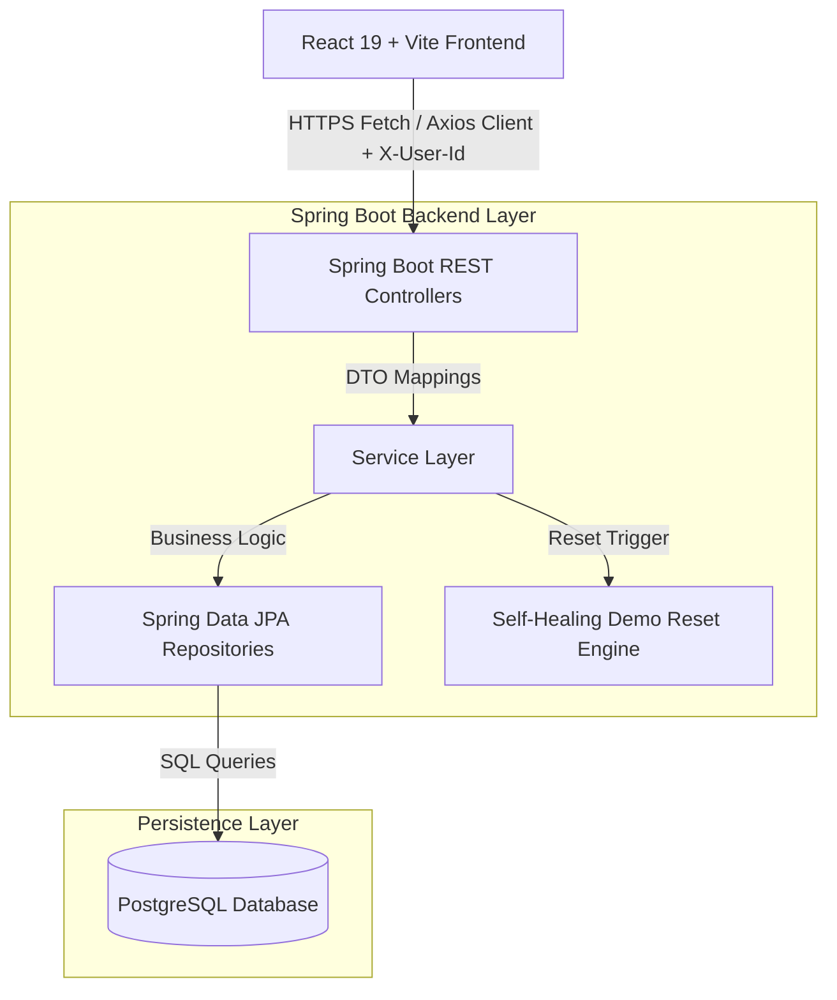
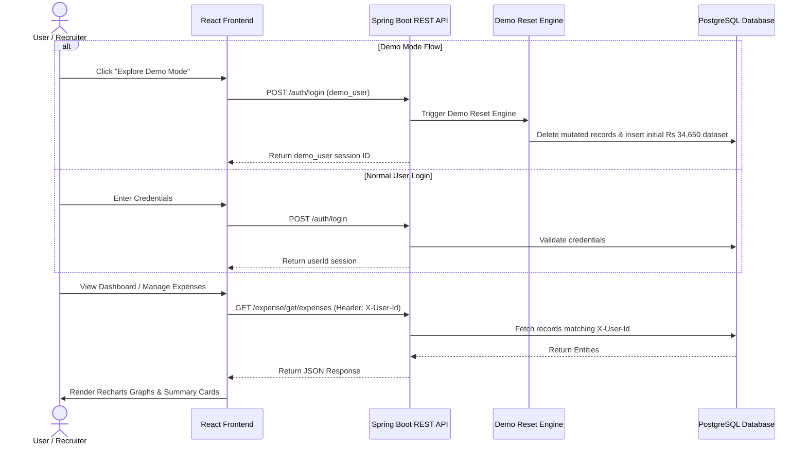
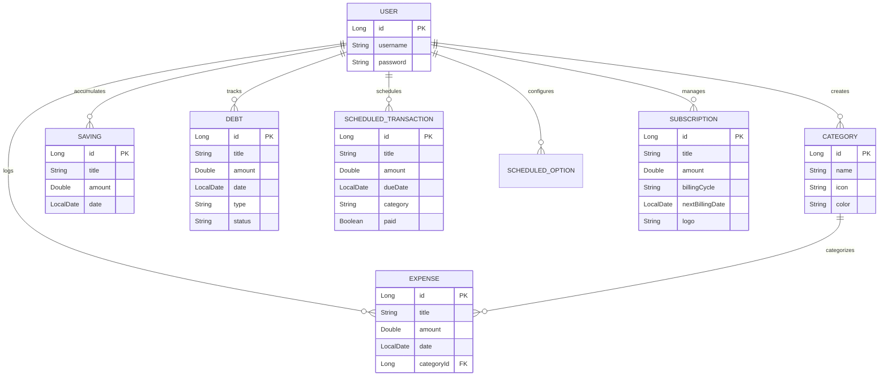
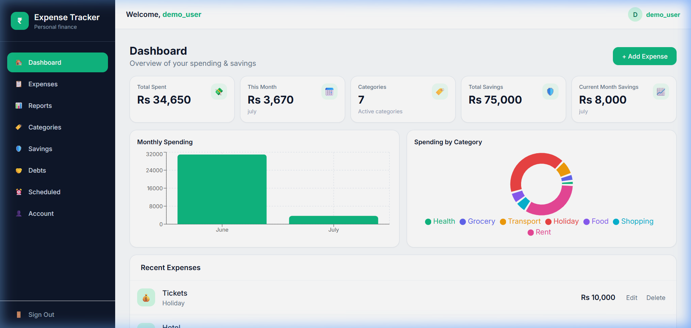
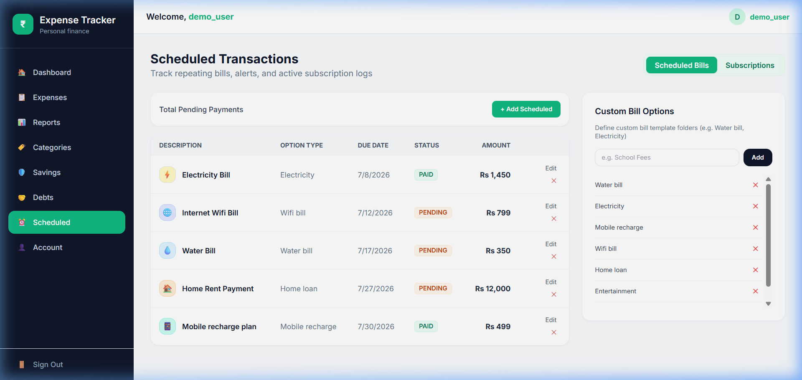
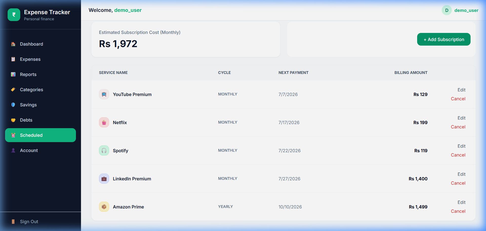

<div align="center">

# 💰 Expense Tracker

### Premium Personal Finance & Portfolio Management Platform

**Spring Boot REST API** × **React 19 + Vite**

[](https://personal-expense-tracker-liart-five.vercel.app)
[](https://openjdk.org/)
[](https://spring.io/projects/spring-boot)
[](https://react.dev/)
[](https://vitejs.dev/)
[](https://www.postgresql.org/)
[](https://tailwindcss.com/)
[](https://recharts.org/)

> 🌐 **Live Application**: [https://personal-expense-tracker-liart-five.vercel.app](https://personal-expense-tracker-liart-five.vercel.app)

**[🎥 Demo Video](#-demo-video) • [🌐 Live Site](https://personal-expense-tracker-liart-five.vercel.app) • [📸 Screenshots](#-user-interface-screenshots) • [📘 API Endpoints](#-api-endpoints)**

</div>

---

## 📌 Overview

A premium Personal Finance and Expense Tracker application configured to help users track and organize their portfolios efficiently. The stack comprises a robust, multi-user **Spring Boot REST API** backend paired with a modern, fully-responsive **React + Vite** frontend interface.

### The Problem
- **Data Cross-Contamination**: Many basic expense tracking applications mix data across user accounts or rely only on temporary client-side state.
- **Static Insights**: Lack of dynamic month-over-month trend visualization and category distributions.
- **Tainted Demo Accounts**: Shared demo accounts get corrupted when testers delete or modify seed data.
- **Fragmented Scope**: Standard tools track expenses but ignore debts (money owed to me vs. owed to others), recurring utility bills, and brand subscriptions.

### The Solution
- **Multi-Tenant User Isolation**: Every REST API call is verified against an `X-User-Id` request context header.
- **Self-Healing Demo Mode**: Any modifications made to `demo_user` are automatically purged and reset back to pristine defaults (**Rs 34,650**) upon re-login.
- **5-Layer Tracking System**: Unifies Expenses, Savings, Debts, Scheduled Utility Bills, and Brand Subscriptions under one interface.
- **Rupee (Rs) Localization**: Full currency localization with responsive Recharts visual graphs.

---

## ✨ Key Features

- **Multi-User Security & Auth**
  - Instant user registration, sign-in, and sign-out capabilities.
  - Secure profile modifications (username changes and password resets).
  - Robust backend resource filtering: all options, categories, expenses, savings, and debts are isolated to each user.
- **Premium Interactive Dashboard**
  - Unified summary cards tracking **Total Spent**, **This Month's Spending**, **Active Categories**, **Total Savings**, and **Current Month's Savings**.
  - Dynamic monthly trend bar charts and category allocation donut charts rendered via Recharts.
  - Direct display of recent expenses for fast tracking.
- **Core Tracking Layers**
  - **Expenses**: CRUD individual entries with name, value, date, and custom category mappings.
  - **Savings**: Dedicated savings logs detailing descriptions, dates, and amounts (no income tab required).
  - **Debts**: Manage money given or borrowed using the dedicated Debt tracker separated by status (*Owed to Me* vs *Owed to Others*).
- **Advanced Bills & Subscriptions Planning**
  - **Scheduled Bills**: Stay on top of utilities (Water, Electricity, Wireless Wifi, Mobile, etc.) with custom options and payment toggles.
  - **Subscriptions Tracker**: Track recurring streaming and utility packages (Netflix, Spotify, YouTube Premium, LinkedIn, Amazon Prime) showing billing cycle, cost, payment due date, and automatically displaying brand icons.
- **Explore Demo Mode (Recruiter View)**
  - Direct portal bypassing standard registration to view a pre-seeded account (`demo_user`) with **Rs 34,650** of preloaded financial logs.
  - **Self-Healing Mechanics**: Every time a user enters Demo Mode, the database cleans all previous mutations, additions, or deletions and restores the demo profile back to the pristine default setup.
- **Rupee (Rs) Support**
  - The UI is fully localized to display amounts in Rupees (Rs).

---

## ⚡ Key Challenges & Engineering Outcomes

| Technical Challenge | Engineering Solution & Outcome |
|:---|:---|
| 🔐 **Multi-Tenant Data Leaks** | Implemented request header context validation (`X-User-Id`) across all Spring Boot REST controllers, enforcing 100% resource isolation per user session. |
| 🔄 **Corrupted Demo Environments** | Built an automated `@Transactional` self-healing database engine triggered on every demo login that purges mutations and restores a pristine **Rs 34,650** portfolio. |
| 🔗 **Foreign Key Violations on Delete** | Engineered audit-safe soft-disassociation unlinking in JPA service layers, preventing deletion of categories or options from breaking historical records. |
| 📊 **Complex Multi-Category Financial Logs** | Structured dedicated JPA domain models for Expenses, Savings, Debts (*Owed to Me* vs *Owed to Others*), Scheduled Utility Bills, and Brand Subscriptions. |
| ⚡ **Real-Time Data Aggregation** | Designed optimized JPA aggregation queries for monthly trend calculations and category allocations, rendered seamlessly with dynamic Recharts graphs. |

---

## 🏗️ System Architecture


```mermaid
graph TD
    Client[React 19 + Vite Frontend] -->|HTTPS Fetch / Axios Client + X-User-Id| Controller[Spring Boot REST Controllers]

    subgraph "Spring Boot Backend Layer"
        Controller -->|DTO Mappings| Service[Service Layer]
        Service -->|Business Logic| Repository[Spring Data JPA Repositories]
        Service -->|Reset Trigger| DemoService[Self-Healing Demo Reset Engine]
    end

    subgraph "Persistence Layer"
        Repository -->|SQL Queries| PostgreSQL[(PostgreSQL Database)]
    end
```

**Layered backend design:**
- **Controller Layer** → validates request headers (`X-User-Id`), processes HTTP payloads
- **Service Layer** → handles business calculations, transactional boundaries (`@Transactional`)
- **Repository Layer** → Spring Data JPA repository abstractions
- **DTO Layer** → ModelMapper decouples JPA database entities from JSON client payloads
- **Demo Engine** → clears state and re-seeds `demo_user` upon every demo login session

---

## 🔄 Control Flow


```mermaid
sequenceDiagram
    actor U as User / Recruiter
    participant FE as React Frontend
    participant API as Spring Boot REST API
    participant SVC as Demo Reset Engine
    participant DB as PostgreSQL Database

    alt Demo Mode Flow
        U->>FE: Click "Explore Demo Mode"
        FE->>API: POST /auth/login (demo_user)
        API->>SVC: Trigger Demo Reset Engine
        SVC->>DB: Delete mutated records & insert initial Rs 34,650 dataset
        API-->>FE: Return demo_user session ID
    else Normal User Login
        U->>FE: Enter Credentials
        FE->>API: POST /auth/login
        API->>DB: Validate credentials
        API-->>FE: Return userId session
    end

    U->>FE: View Dashboard / Manage Expenses
    FE->>API: GET /expense/get/expenses (Header: X-User-Id)
    API->>DB: Fetch records matching X-User-Id
    DB-->>API: Return Entities
    API-->>FE: Return JSON Response
    FE->>U: Render Recharts Graphs & Summary Cards
```

---

## 🗂️ Entity Relationship (UML)


```mermaid
erDiagram
    USER ||--o{ EXPENSE : logs
    USER ||--o{ CATEGORY : creates
    USER ||--o{ SAVING : accumulates
    USER ||--o{ DEBT : tracks
    USER ||--o{ SCHEDULED_TRANSACTION : schedules
    USER ||--o{ SCHEDULED_OPTION : configures
    USER ||--o{ SUBSCRIPTION : manages

    CATEGORY ||--o{ EXPENSE : categorizes

    USER {
        Long id PK
        String username
        String password
    }
    CATEGORY {
        Long id PK
        String name
        String icon
        String color
    }
    EXPENSE {
        Long id PK
        String title
        Double amount
        LocalDate date
        Long categoryId FK
    }
    SAVING {
        Long id PK
        String title
        Double amount
        LocalDate date
    }
    DEBT {
        Long id PK
        String title
        Double amount
        LocalDate date
        String type
        String status
    }
    SCHEDULED_TRANSACTION {
        Long id PK
        String title
        Double amount
        LocalDate dueDate
        String category
        Boolean paid
    }
    SUBSCRIPTION {
        Long id PK
        String title
        Double amount
        String billingCycle
        LocalDate nextBillingDate
        String logo
    }
```

---

## 📸 User Interface Screenshots

### Modern Compact Dashboard


### Scheduled Bills Utility


### Brand Subscriptions Tracker


---

## 🎥 Demo Video

> _Watch the complete application walkthrough showcasing multi-user authentication, self-healing demo mode, financial dashboard analytics, scheduled utility bills, and brand subscriptions._

[](#)

---

## 📁 File Structure

```text
Expense-Tracker/
├── application/                     # Spring Boot Backend
│   ├── src/main/java/com/expensetracker/application/
│   │   ├── controller/              # REST Endpoints
│   │   │   ├── AuthController.java
│   │   │   ├── CategoryController.java
│   │   │   ├── DebtController.java
│   │   │   ├── ExpenseController.java
│   │   │   ├── SavingController.java
│   │   │   ├── SavingsController.java
│   │   │   ├── ScheduledController.java
│   │   │   └── SubscriptionController.java
│   │   ├── model/                   # Database Entities (JPA)
│   │   ├── repository/              # Spring Data JPA repositories
│   │   ├── payload/                 # DTO transfer payloads
│   │   └── exceptions/              # Global Error handlers
│   └── src/main/resources/
│       └── application.properties   # Connection configurations
│
└── frontend/                        # React + Vite Frontend
    ├── src/
    │   ├── api/                     # Axios API Clients
    │   ├── components/              # Shared UI components
    │   ├── pages/                   # Application Screen Layouts
    │   │   ├── Login.jsx
    │   │   ├── Dashboard.jsx
    │   │   ├── Expenses.jsx
    │   │   ├── Savings.jsx
    │   │   ├── Debts.jsx
    │   │   ├── Scheduled.jsx
    │   │   └── Account.jsx
    │   ├── utils/                   # Formatter helper tools
    │   ├── App.jsx
    │   └── main.jsx
    └── tailwind.config.js
```

---

## 📡 API Endpoints

### Authentication APIs
| Endpoint | Method | Description |
|:---|:---|:---|
| `/auth/register` | POST | Sign up a new user |
| `/auth/login` | POST | Sign in an existing user / Auto-resets `demo_user` |
| `/auth/update-profile` | PUT | Edit username and password |

### Expense APIs
| Endpoint | Method | Description |
|:---|:---|:---|
| `/expense/add/expense` | POST | Create a new expense entry |
| `/expense/get/expenses` | GET | Retrieve all user expenses |
| `/expense/update/{expenseId}` | PUT | Modify a specific expense |
| `/expense/delete/expenseid/{expenseId}` | DELETE | Remove an expense |
| `/expense/delete/allexpenses` | DELETE | Remove all user expenses |
| `/expense/expenses/total` | GET | Retrieve total sum of expenses |
| `/expense/monthwise` | GET | Retrieve monthly breakdown |

### Category APIs
| Endpoint | Method | Description |
|:---|:---|:---|
| `/category/get/categories` | GET | View all user categories |
| `/category/add/category` | POST | Create a custom category |
| `/category/update/category/{categoryId}` | PUT | Edit a category |
| `/category/delete/id/{categoryId}` | DELETE | Delete a category |

### Savings APIs
| Endpoint | Method | Description |
|:---|:---|:---|
| `/savings/get/all` | GET | View all savings entries |
| `/savings/add` | POST | Add a savings log |
| `/savings/update/{savingId}` | PUT | Update a savings entry |
| `/savings/delete/{savingId}` | DELETE | Delete a savings log |
| `/savings/summary` | GET | Get total and monthly savings sums |

### Debt APIs
| Endpoint | Method | Description |
|:---|:---|:---|
| `/debts/get/all` | GET | View all debt logs |
| `/debts/add` | POST | Create a new debt log |
| `/debts/update/{debtId}` | PUT | Update a debt entry |
| `/debts/delete/{debtId}` | DELETE | Delete a debt log |

### Scheduled Transactions & Subscriptions APIs
| Endpoint | Method | Description |
|:---|:---|:---|
| `/scheduled/get/all` | GET | View scheduled transactions |
| `/scheduled/add` | POST | Create scheduled bill |
| `/scheduled/update/{scheduledId}` | PUT | Modify scheduled bill |
| `/scheduled/options` | GET | View scheduled utility categories |
| `/scheduled/options/add` | POST | Add scheduled utility option |
| `/subscriptions/get/all` | GET | View active subscriptions |
| `/subscriptions/add` | POST | Add subscription package |
| `/subscriptions/update/{subscriptionId}` | PUT | Edit subscription package |
| `/subscriptions/delete/{subscriptionId}` | DELETE | Remove subscription package |

---

## 🚀 How to Run

### 1. Prerequisites
- **Java Development Kit (JDK 17)**
- **Maven**
- **Node.js (v18+)**
- **PostgreSQL Database**

---

### 2. Configure Database Backend
1. Create a database in your local PostgreSQL cluster (e.g. `expense_tracker`).
2. Open `application/src/main/resources/application.properties` and update the datasource credentials:
   ```properties
   spring.datasource.url=jdbc:postgresql://localhost:5432/expense_tracker
   spring.datasource.username=your_postgres_username
   spring.datasource.password=your_postgres_password
   spring.jpa.hibernate.ddl-auto=update
   ```

---

### 3. Run the Backend Server
```bash
cd application
mvn spring-boot:run
```
The server starts listening on [http://localhost:8080](http://localhost:8080).

---

### 4. Run the React Frontend
1. Change into the frontend folder:
   ```bash
   cd ../frontend
   ```
2. Install server dependencies:
   ```bash
   npm install
   ```
3. Boot the Vite development environment:
   ```bash
   npm run dev
   ```
Navigate to [http://localhost:5173](http://localhost:5173) in your web browser.

---

## 🧰 Technologies Used

- **JDK 17 & Spring Boot** (REST Web Services)
- **Spring Data JPA & PostgreSQL** (Data Persistence)
- **ModelMapper** (Entity-DTO conversions)
- **Vite & React** (User Interface Layer)
- **TailwindCSS** (Vanilla Styling base framework)
- **Recharts** (Visual graphs and charts rendering)
- **Axios** (API Server communication)
